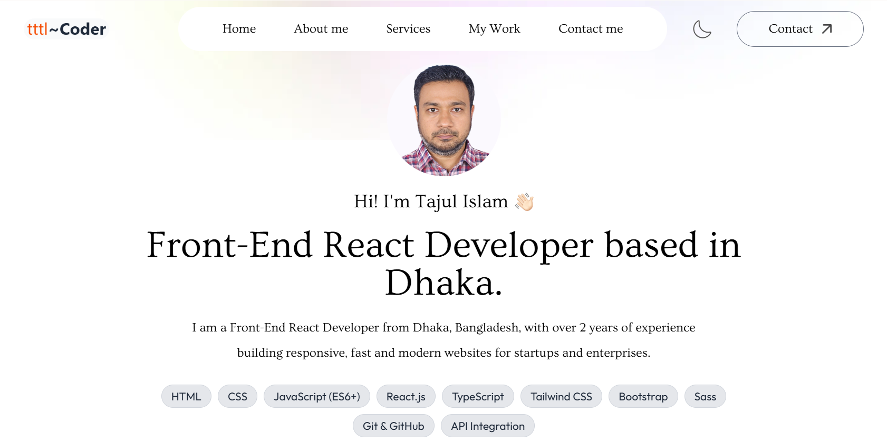

# 👨‍💻 Personal Portfolio Website

A modern and responsive **developer portfolio** built using **React.js** and **Tailwind CSS**. This project showcases my skills, projects, and contact information with dark mode support and smooth navigation.

## 🚀 Live Demo

🔗 [View Portfolio](https://tajulbappy.netlify.app/)

## 📸 Preview

## 🛠️ Built With

- ⚛️ React.js
- 🎨 Tailwind CSS
- 🌘 Dark Mode Toggle
- 🔔 React Toastify
- 📱 Fully Responsive Design

## 💡 Features

- 🌓 Light/Dark Mode toggle with state persistence
- 📬 Contact form with **React Toastify** notifications
- 💼 Showcases featured projects with live links and GitHub repos
- 📱 Mobile-first and responsive across all screen sizes
- ⚡ Fast performance and clean UI

Author
Md. Tajul Islam
🌐 [Portfolio Website](https://tajulbappy.netlify.app/)
📧 bappy042@gmail.com
👨‍💻 [GitHub](https://github.com/tajulbappy)

© 2025 Tajul Islam. All rights reserved.
